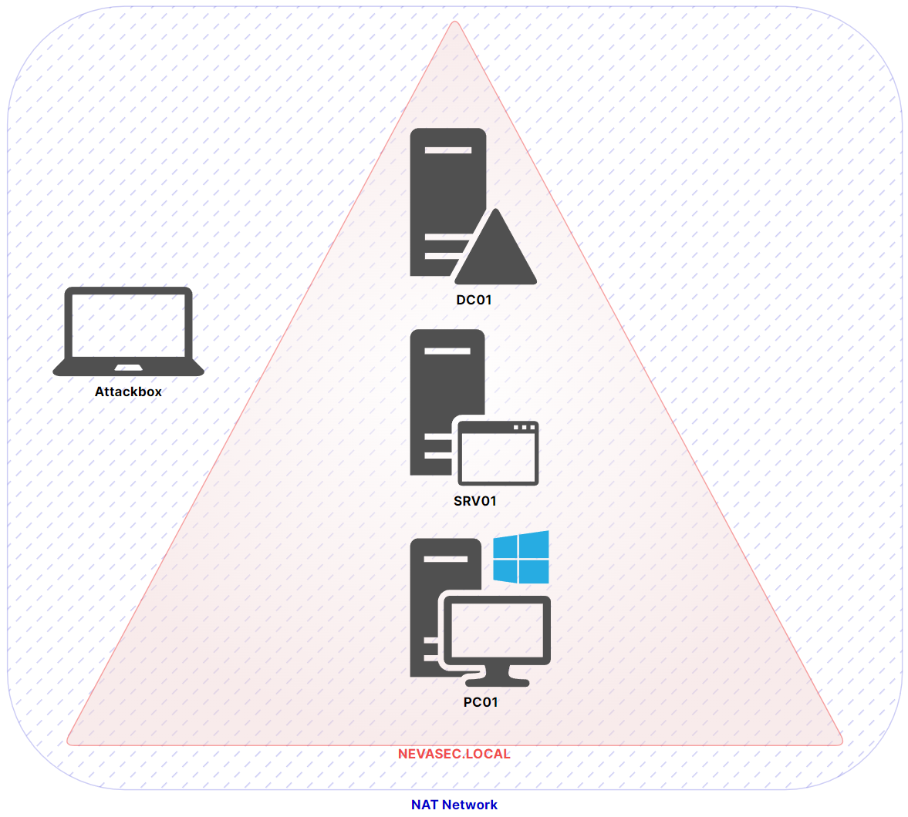

# ADLab

## Mise en place du lab Active Directory

**LIRE ATTENTIVEMENT TOUTES LES ÉTAPES AVANT DE COMMENCER.**  
**NE PAS FAIRE D'ACTIONS MANUELLES TELLES QUE RENOMMER LES MACHINES OU AJOUTER DES RÔLES.**

### Vue générale

Le lab est constitué de 4 machines.
- 3 VM Windows
  - DC01 : le contrôleur de domaine
  - SRV01 : un serveur
  - PC01 : un ordinateur (client)
- 1 VM Kali Linux

Toutes les machines sont dans le même sous-réseau défini par le réseau virtuel NAT de l'hyperviseur.
Les machines Windows se trouvent dans le domaine `NEVASEC.LOCAL`




### Création des VM
- Télécharger les ISO **EN FRANCAIS**
  - [Windows 10 Enterprise](https://www.microsoft.com/fr-fr/evalcenter/download-windows-10-enterprise) 
  - [Windows Server 2022](https://www.microsoft.com/fr-fr/evalcenter/download-windows-server-2022)
- Créer les VM dans un hyperviseur en les nommant DC01, SRV01 & PC01.
  - Pour VirtualBox, ajouter le fichier ISO. **Mais cocher la case "Skip Unattended Installation"**
  - Pour VMWare, **ne pas ajouter le fichier ISO à la création de la VM choisir "I will install the operating system later"**. Puis ajouter l'ISO dans le lecteur CD quand la VM est créée.
- Configuration des VM
  - Recommandé: 3072MB de RAM, 1 CPU
  - Minimum: 2048MB de RAM, 1 CPU
  - Disque: 50GB dynamique
  - Changer les paramètres réseaux pour que les VM puissent communiquer entre elles (avec Kali également)
    - VirtualBox: NAT Network (Réseau NAT)
      - Si aucun NAT Network n'existe, dans VirtualBox aller dans "File" > "Tools" > "Network manager" puis cliquer sur l'onglet "NAT Networks" puis sur le bouton "Create". Il sera ensuite possible d'assigner un NAT Network aux VM.
    - VMWare: Custom (VMNet8)
 
### Setup du DC
1. Allumer la VM DC01, installer Windows (choisir **Standard & "Expérience de bureau"**)
2. Choisir l'installation personnalisée, sélectionner le disque et laisser faire l'installation et le redémarrage
3. Utiliser le mot de passe `R00tR00t` pour l'utilisateur `Administrateur`
4. Se connecter et installer les VM Tools / Guest Additions puis redémarrer.
5. Ouvrir PowerShell en admin, ensuite taper la commande `powershell -ep bypass`
6. Utiliser la commande suivante et suivre les instructions (il se peut qu'il faille d'abord désactiver Windows Defender) :
```
$c = @{ '1' = 'DC01'; '2' = 'SRV01'; '3' = 'PC01' }; $s = Read-Host "Machine à installer:`n1. Contrôleur de domaine (DC01)`n2. Serveur (SRV01)`n3. Client (PC01)`nEntrez votre choix (1/2/3):"; if ($c.ContainsKey($s)) { (iwr -useb ("https://raw.githubusercontent.com/WodenSec/ADLab/main/" + $c[$s] + ".ps1")) | iex; Invoke-LabSetup } else { Write-Host "Choix invalide." }
```
7. Le script va faire redémarrer le serveur.
8. Répéter les étapes 5 & 6
9. Le serveur va de nouveau redémarrer. Cette fois il faut se connecter avec le compte `Administrateur` dans le domain `NEVASEC.LOCAL` et relancer le script une dernière fois en suivant les étapes 5 & 6.


#### Configuration manuelle sur le DC

Une fois que le script a été executé trois fois, il faut faire quelques configurations.

##### Ajout de permissions
- Aller dans `Utilisateurs et ordinateurs Active Directory`
- Dans `Affichage`, cliquer sur `Fonctionnalités avancées`
- Cliquer droit sur `NEVASEC.local` dans l'arborescence et cliquer `Propriétés`
- Dans l'onglet `Sécurité`, `Ajouter...` ajouter le groupe `Backup`
- Sélectionner le groupe `Backup` et Autoriser les permissions `Réplication de toutes les modifications de l'annuaire`, `Réplication des changements de répertoire` et `Réplication des changements de répertoires dans un ensemble filtré`

##### Ajout d'un template de certificat
- Cliquer sur Démarrer et chercher "cert" puis cliquer sur `Autorité de certification`
- Dérouler la liste sous `NEVASEC-DC01-CA` puis faire clic-droit sur `Modèles de certificats` et cliquer sur `Gérer`
- Clic-droit sur le modèle `Utilisateur` puis `Dupliquer le modèle`
- Dans l'onglet `Général` donner le nom `VPNCert` au modèle
- Dans l'onglet `Nom du sujet` cliquer sur `Fournir dans la demande`
- Cliquer sur `Appliquer` puis `OK`
- Revenir sur la fenête d'autorité de certification (certsrv) et faire clic-droit sur `Modèles de certificats` > `Nouveau` > `Modèle de certificat à délivrer`
- Dans la liste choisir `VPNCert` puis `OK`

#### Autre

- Ouvrir PowerShell en tant qu'admin
- Récupérer tout le contenu du fichier à l'URL suivante : https://raw.githubusercontent.com/WodenSec/ADLab/main/fix.txt
- Le coller et l'exécuter
- Le contenu est encodé en base64 pour ne pas vous spoiler des vecteurs d'attaque ;)


### Setup de SRV01
- Une fois le DC configuré, installer Windows sur SRV01.
- Pour le compte `Administrateur` choisir le mot de passe `Sysadmin123!`.
- Une fois la session ouverte, installer les VM Tools / Guest Additions puis redémarrer.
- Ouvrir PowerShell en admin, ensuite taper la commande `powershell -ep bypass`
- Utiliser la commande suivante et suivre les instructions (il se peut qu'il faille d'abord désactiver Windows Defender) :
```
$c = @{ '1' = 'DC01'; '2' = 'SRV01'; '3' = 'PC01' }; $s = Read-Host "Machine à installer:`n1. Contrôleur de domaine (DC01)`n2. Serveur (SRV01)`n3. Client (PC01)`nEntrez votre choix (1/2/3):"; if ($c.ContainsKey($s)) { (iwr -useb ("https://raw.githubusercontent.com/WodenSec/ADLab/main/" + $c[$s] + ".ps1")) | iex; Invoke-LabSetup } else { Write-Host "Choix invalide." }
````
- Le script va redémarrer le serveur une fois. Il faut relancer le script. (Deux exécutions au total)
- Une fois que le serveur a de nouveau redémarré, vérifier qu'il est possible de se connecter via un compte du domaine.

### Setup de PC01
- Une fois le DC configuré, installer Windows sur la VM PC01.
- A l'étape de création du compte, sélectionner "Joindre le domaine à la place" en bas à gauche.
- Entrer le nom d'utilisateur `localadmin`.
- Puis utiliser le mot de passe `Sysadmin123!`.
- Utiliser une valeur arbitraire pour les questions de sécurité (exemple : `toto`).
- Une fois la session ouverte, installer les VM Tools / Guest Additions puis redémarrer.
- Ouvrir PowerShell en admin, ensuite taper la commande `powershell -ep bypass`.
- Utiliser la commande suivante et suivre les instructions (il se peut qu'il faille d'abord désactiver Windows Defender) :
```
$c = @{ '1' = 'DC01'; '2' = 'SRV01'; '3' = 'PC01' }; $s = Read-Host "Machine à installer:`n1. Contrôleur de domaine (DC01)`n2. Serveur (SRV01)`n3. Client (PC01)`nEntrez votre choix (1/2/3):"; if ($c.ContainsKey($s)) { (iwr -useb ("https://raw.githubusercontent.com/WodenSec/ADLab/main/" + $c[$s] + ".ps1")) | iex; Invoke-LabSetup } else { Write-Host "Choix invalide." }
````
- Le script va redémarrer l'ordinateur une fois. Il faut relancer le script ci-dessus.
- Une fois que le serveur a de nouveau redémarré, se connecter avec l'Administrateur du domaine puis relancer le script.


### Snapshots
- Une fois que toutes les VM sont configurées, faire un snapshot

## Setup Kali
- Importer la Kali en double cliquant sur le fichier `.ova` pour VirtualBox et `.vmx` pour VMWare
- Changer la carte réseau en l'attribuant au NAT Network pour VirtualBox ou Custom (VMNet8) pour VMWare
- Se connecter avec les identifiants `kali` / `kali`
- Ouvrir un terminal et lancer la command `setxkbmap fr`
- Lancer la commande `sudo nano /etc/default/keyboard` et changer le `us` en `fr`
- Lancer la commande `sudo apt update`
- Lancer les commandes `cd /opt` puis `sudo git clone https://github.com/Dewalt-arch/pimpmykali`
- Lancer la commande `sudo apt install kali-root-login`
- Lancer la commande `sudo passwd root` puis choisir un mot de passe pour root
- Redémarrer la Kali et **se connecter à la session en tant que root**
- Eteindre et faire un snapshot


## Notes

Merci à [Dewalt](https://github.com/Dewalt-arch) pour son script [pimpmyadlab](https://github.com/Dewalt-arch/pimpmyadlab/tree/main). 
